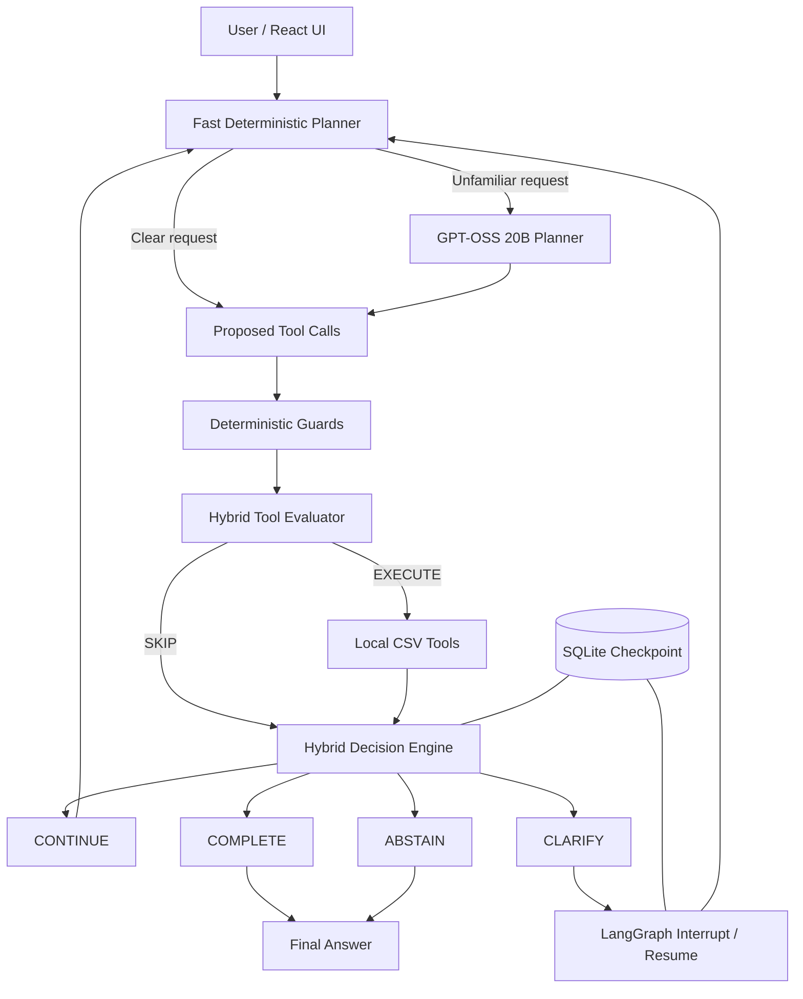

# ActWise Agent

ActWise is a tool-using AI agent designed to decide not only **what tool to call**, but also **whether it should act at all**.

Most tool-calling agents focus on selecting and executing tools. ActWise adds a decision-control layer that explicitly chooses between:

- `CONTINUE` — more work is needed
- `COMPLETE` — the task has been solved
- `CLARIFY` — required information is missing or ambiguous
- `ABSTAIN` — the task cannot be completed reliably with the available tools

The current version works with local CSV data and is intentionally kept small so the agent-control behaviour can be evaluated clearly.

---

## Why I Built It
A normal tool-calling agent can often call a technically valid tool even when that tool is unnecessary, when the user request is ambiguous, or when the requested operation is outside the agent's capabilities.

For example:

```text
User: What is the average?
The agent should not guess a file or column.
Decision: CLARIFY
Another example:
User: Upload customers.csv to S3.
If no upload tool exists, the agent should not pretend that it can complete the request.
Decision: ABSTAIN
ActWise focuses on making these decisions explicit and measurable.
## Core Idea
The agent separates three questions:
1. What does the user want?
2. Is a tool call actually useful?
3. After the tool result, should the agent continue, complete, clarify, or abstain?
This creates a control layer around normal LLM tool use.
## Architecture



ActWise combines deterministic routing with an LLM fallback. Clear requests use the fast path, while unfamiliar requests can fall back to GPT-OSS 20B.
## Hybrid Planning
ActWise does not send every request directly to an LLM.
For common and well-defined operations, a deterministic planner handles the request immediately.
Examples:
"What is the average premium in customers.csv?"
    -> calculate_summary

"Show four sample rows from customers.csv."
    -> preview_rows

"Find duplicate customer IDs in customers.csv."
    -> find_duplicates
If the deterministic planner cannot confidently understand the request, ActWise falls back to an LLM planner.
The current LLM fallback uses:
openai/gpt-oss-20b
through the Groq API.
This hybrid design reduces unnecessary model calls while keeping an LLM fallback for unfamiliar wording.
## Decision Layer

The decision engine evaluates the user request, tool history, and tool results. It returns one of four explicit states.

### COMPLETE

Used when the requested task has been successfully completed.

```text
User:
What is the average premium in customers.csv?

Tool:
calculate_summary

Decision:
COMPLETE
CLARIFY
Used when important information is missing and must come from the user.
User:
Calculate the total in customers.csv.

Decision:
CLARIFY

Reason:
The user needs to specify one column to summarize.
ABSTAIN
Used when the requested action cannot be completed reliably with the available tools.
User:
Upload customers.csv to S3.

Decision:
ABSTAIN
CONTINUE
Used when useful work still remains after the current step.
The workflow returns to planning instead of stopping too early.
## Tool Layer
ActWise currently exposes seven local tools:
Tool	Purpose
list_files	List files available in the workspace
inspect_csv	Inspect columns and row count
preview_rows	Preview sample records
find_duplicates	Find duplicate values in a selected column
calculate_summary	Calculate numeric summary statistics
filter_rows	Filter records using a column and value
create_report	Generate a local text report


The deliberately small tool set makes it easier to test whether the agent knows its capability boundaries.
## Example Dataset
The included sample data contains customer information:
customer_id
name
age
city
premium
It also includes intentional duplicate customer IDs so duplicate detection can be tested.
Example request:
Find duplicate customer IDs and calculate the average age in customers.csv.
ActWise can plan both operations in the same step:
find_duplicates
calculate_summary
and complete the task without unnecessary inspection calls.
## Tool Guards
A proposed tool call is not automatically executed.
Before execution, ActWise checks whether the tool call is useful.
For example, if the filename is already known:
customers.csv
the agent should not call list_files just to rediscover it.
Similarly, if a user asks:
What is the average premium in customers.csv?
ActWise can call calculate_summary directly rather than first inspecting the CSV.
The guards also prevent repeated calls within the same run.
## Ambiguity Handling
One of the main goals of the project is avoiding guesses.
For example:
Find duplicates in customers.csv.
The user has not specified which column should be checked.
ActWise first inspects the available columns and then returns:
CLARIFY
instead of silently assuming customer_id.
The same approach is used for ambiguous summaries and filters.
## Capability Boundaries
ActWise explicitly recognizes requests it cannot currently complete.
Examples include:
Upload a file to S3
Send a file by email
Create a chart
Delete records
Join datasets
Rename files
Sort and save datasets
These produce:
ABSTAIN
instead of fabricated success.
A filtered aggregate is another deliberate boundary.
For example:
Show Kolkata customers and calculate their average premium.
The current tool set can filter the rows, but it does not calculate an aggregate over the filtered intermediate result.
ActWise therefore performs the supported filtering step and then abstains rather than returning the average for the entire file.
## LangGraph Workflow
The agent workflow is implemented as a LangGraph state machine.
The graph handles:
planning
    |
tool evaluation
    |
tool execution
    |
decision
    |
routing
For clarification requests, LangGraph interrupts the workflow.
When the user provides the missing information, the graph can resume using the same thread.
SQLite is used as the checkpointer:
data/actwise.db
This allows conversation state to persist across requests.
## API
The backend is exposed with FastAPI.
Main endpoints:
GET  /health
POST /agent/run
POST /agent/resume
/agent/run starts a new agent task.
/agent/resume continues a workflow after a clarification interrupt.
Run the backend:
python -m uvicorn backend.main:app --reload
## Web Interface
A small React/Vite interface is included in:
web/
It displays:
user request
final response
current decision
executed tools
skipped tools
decision history
thread ID
clarification/resume flow
Run it with:
cd web
npm install
npm run dev
The development UI runs on port 5174.
## Project Structure
actwise-agent/
├── backend/
│   ├── agent.py
│   ├── answer_builder.py
│   ├── decision.py
│   ├── decision_engine.py
│   ├── fast_planner.py
│   ├── graph.py
│   ├── graph_agent.py
│   ├── guards.py
│   ├── llm.py
│   ├── main.py
│   ├── state.py
│   ├── tool_evaluator.py
│   └── tools.py
│
├── scenarios/
│   ├── evaluation_v1.json
│   ├── evaluation_v2.json
│   ├── regression_v3.json
│   ├── regression_v4.json
│   ├── holdout_v1.json
│   ├── holdout_v2.json
│   └── holdout_v3.json
│
├── tests/
│   ├── run_actwise_benchmark.py
│   ├── run_fair_benchmark.py
│   ├── run_v2_benchmark.py
│   ├── run_regression_v3.py
│   ├── run_regression_v4.py
│   ├── run_holdout_benchmark.py
│   └── run_holdout_v3.py
│
├── results/
├── workspace/
├── data/
├── web/
├── requirements.txt
└── README.md
## Benchmark Summary

| Evaluation | Scenarios | Success |
|---|---:|---:|
| V2 Development | 40 | 100% |
| Regression V3 | 10 | 100% |
| Regression V4 | 12 | 100% |
| Holdout V1 | 20 | 75% |
| Holdout V2 | 20 | 70% |
| Final Holdout V3 | 20 | **95%** |

Final Holdout V3 achieved:

- **95% overall success**
- **100% decision accuracy**
- **95% required-tool coverage**
- **1 unnecessary tool call**
- **0.175s average latency**

## Evaluation Strategy
I did not rely only on a single benchmark.
The evaluation process was separated into development, regression, and holdout sets.
### Development Benchmark
The V2 benchmark contains 40 scenarios covering:
direct requests
multi-operation requests
paraphrases
clarification
invalid columns
missing files
unsupported actions
unsupported composite operations
Final result:
40 / 40 passed
100% decision accuracy
100% required-tool coverage
0 extra tool calls
### Regression V3
A first unseen holdout exposed problems with:
filter paraphrases
preview paraphrases
missing context
report requests without filenames
filtered aggregate requests
Those failure classes were moved into a separate regression set.
Result after fixing the general behaviour:
10 / 10 passed
100% decision accuracy
0 extra tool calls
### Regression V4
A second unseen evaluation exposed additional wording variations around:
row counts
filter requests
ambiguous filter criteria
cloud storage
visualizations
dataset combinations
A separate regression suite was created for those failure classes.
Final result:
12 / 12 passed
100% decision accuracy
100% required-tool coverage
0 extra tool calls
## Holdout Evaluation
Holdout tests were kept separate from development tests.
Once a holdout was evaluated, its original score was preserved instead of repeatedly tuning against the same questions.
### Holdout V1
Overall success:       75%
Decision accuracy:     80%
Required-tool coverage: 90%
The failures were used to create Regression V3.
### Holdout V2
Overall success:       70%
Decision accuracy:     75%
Required-tool coverage: 90%
The new failure classes were used to create Regression V4.
### Final Holdout V3
The final evaluation used 20 previously unseen scenarios.
Overall success:        19 / 20
Success rate:           95%
Decision accuracy:      100%
Required-tool coverage: 95%
Extra tool calls:       1
Average latency:        0.175s
The only failed scenario still produced the correct CLARIFY decision. The failure was caused by choosing calculate_summary instead of the expected inspect_csv, resulting in one unnecessary tool call.
So on the final unseen benchmark:
Decision correctness: 20 / 20
Exact benchmark success: 19 / 20
## Tool-Call Efficiency
I also compared ActWise against a more conventional LLM tool-calling baseline using the same GPT-OSS 20B model on supported completion tasks.
Result:
Baseline tool calls: 12
ActWise tool calls:    8

Tool calls saved:      4
Reduction:            33.3%

Baseline extra tools:  4
ActWise extra tools:    0
Both systems found the required tools in all seven evaluated completion scenarios.
The difference was mainly unnecessary tool usage.
## Latency Optimisation
The initial implementation relied heavily on LLM calls for planning, tool evaluation, decision making, and answer generation.
For one representative multi-operation request, the original workflow used:
14 LLM calls
~11.47 seconds
After routing and hybrid decision improvements:
5 LLM calls
~3.37 seconds
After introducing the deterministic fast planner:
0 LLM calls on the direct fast path
~0.01 seconds for that request
The final Holdout V3 benchmark averaged:
0.175 seconds
This number includes many requests handled by deterministic paths, so it should be viewed as an architecture-level benchmark for this local test workload rather than raw LLM inference latency.
## Design Decisions
Deterministic logic where the intent is obvious
An LLM is unnecessary for requests such as:
average premium
first five rows
duplicate customer IDs
Using deterministic routing makes these operations faster and more predictable.
LLM fallback for unfamiliar language
The deterministic layer is intentionally not expected to understand every possible request.
Unknown requests can fall back to GPT-OSS 20B.
This keeps the system flexible without requiring an LLM for every step.
Separate planning from decision control
Choosing a tool and deciding whether the overall task is complete are different problems.
ActWise keeps these responsibilities separate.
Explicit abstention
The agent is allowed to say that it cannot reliably perform an operation.
This is preferable to pretending an unavailable capability exists.
Preserve real holdout scores
Holdout failures were not silently removed or repeatedly rerun until they passed.
The initial unseen scores are kept as part of the evaluation history.
## Current Limitations
ActWise V1 is intentionally limited.
It currently:
works primarily with local CSV operations
uses simple deterministic intent parsing for common requests
does not execute arbitrary Python generated by an LLM
does not modify CSV records
does not support charts
does not upload files to cloud services
does not send email
does not join multiple datasets
cannot aggregate directly over a filtered intermediate dataset
has been evaluated on a relatively small benchmark set
The next version could expand the tool set while keeping the same decision-control architecture.
## Running Locally
Create and activate your Python environment, then install dependencies:
pip install -r requirements.txt
Create a .env file:
GROQ_API_KEY=your_key_here
Do not commit .env.
Start the backend:
python -m uvicorn backend.main:app --reload
Run the frontend separately:
cd web
npm install
npm run dev
## Running Evaluations
Development benchmark:
python -m tests.run_v2_benchmark
Regression V3:
python -m tests.run_regression_v3
Regression V4:
python -m tests.run_regression_v4
Final Holdout V3:
python -m tests.run_holdout_v3
The holdout files should be treated as evaluation records, not as prompts to continue tuning the current V1 implementation.
## Status
ActWise V1 is feature complete.
Final unseen evaluation:
95% overall benchmark success
100% decision accuracy
95% required-tool coverage
1 unnecessary tool call
The next work is focused on documentation, visualization, and possible V2 extensions rather than further tuning against the existing benchmarks.
