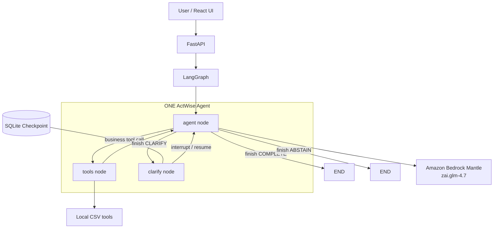

# ActWise Agent (V2)

ActWise is a model-directed single-agent LangGraph system with deterministic
execution and safety boundaries.

It is a tool-using AI agent that decides not only **which tool to call**, but
also **whether it should act at all** — choosing explicitly between:

- `CONTINUE` — more work is needed (implicit: the model requests a tool)
- `COMPLETE` — the task has been solved
- `CLARIFY` — required information is missing or ambiguous
- `ABSTAIN` — the task cannot be completed reliably with the available tools

---

## Problem Statement

Most tool-calling agents focus only on selecting and executing tools. They
will often call a technically valid tool even when it's unnecessary, guess at
missing information instead of asking, or quietly substitute a plausible
answer when the exact thing the user asked for doesn't exist. ActWise adds an
explicit control layer around normal LLM tool use so these failure modes are
visible and measurable instead of silently baked into the output.

```text
User: What is the average revenue in customers.csv?
customers.csv has no "revenue" column, only "premium".
The agent must not silently substitute "premium".
Decision: CLARIFY

User: Upload customers.csv to S3.
No upload tool exists.
Decision: ABSTAIN
```

---

## Architecture



**Request flow:**

React UI → FastAPI → LangGraph → **one** ActWise agent → Amazon Bedrock
Mantle (`zai.glm-4.7`) → local CSV tools → tool observations back to the
**same** agent → `CONTINUE` / `COMPLETE` / `CLARIFY` / `ABSTAIN`.

There is exactly one agent and exactly three LangGraph nodes: `agent`,
`tools`, `clarify`. There is no planner node, no decision node, no evaluator
node, no critic, no second agent, no RAG, and no MCP.

---

## The Model Owns Semantic Reasoning

This is the core design change from V1. The model — not Python — decides:

- what the user wants
- whether a tool is required
- which tool to use, and its arguments
- whether more work is needed
- `CONTINUE`, `COMPLETE`, `CLARIFY`, or `ABSTAIN`

Python is limited to:

- tool execution
- schema/argument validation
- workspace path safety
- exact-duplicate tool-call prevention
- maximum-step protection
- exception handling
- LangGraph routing
- SQLite checkpointing

There is no regex or keyword logic (`if "average" in text`, `if "email" in
text`, …) deciding intent, tool choice, or the CONTINUE/COMPLETE/CLARIFY/
ABSTAIN decision anywhere in the runtime path.

### Control tool

Alongside the 7 business tools, the model is given one control tool:

```text
finish(decision: COMPLETE | CLARIFY | ABSTAIN, message: string)
```

`CONTINUE` is implicit — it's simply what happens whenever the model requests
one or more business tools instead of calling `finish`. A single model turn
must contain either business tool call(s) **or** one `finish()` call, never
both; if the model violates that (or calls no tool at all), Python treats it
as a protocol error and asks the model to correct itself on the next turn —
this is a routing safeguard, not a semantic decision.

---

## Runtime Model

ActWise V2 runs on **Amazon Bedrock Mantle**, via an OpenAI-compatible Chat
Completions client with client-side tool calling:

```text
OPENAI_BASE_URL=https://bedrock-mantle.ap-south-1.api.aws/v1
ACTWISE_MODEL=zai.glm-4.7
```

There is no Groq, Cerebras, or Gemini dependency in the runtime.

---

## Tool Layer

V2 retains the same seven business-tool categories:

| Tool | Purpose |
|---|---|
| `list_files` | List files available in the workspace |
| `inspect_csv` | Inspect columns and row count |
| `preview_rows` | Preview sample records |
| `find_duplicates` | Find duplicate values in an explicitly named column |
| `calculate_summary` | Calculate numeric summary statistics for an explicitly named column |
| `filter_rows` | Filter records using an explicitly named column and value |
| `create_report` | Generate a local text report |

`find_duplicates` requires an explicit `column` argument — there is no
silent default to `customer_id`. If the model calls it without a column, the
tool call fails validation and the model must ask the user or pick a real
column from a prior observation.

Tool descriptions instruct the model to treat user-provided filenames,
columns, and values literally, and never substitute a different existing
field because it looks semantically similar — if the requested field doesn't
exist and the correct one can't be known with certainty, the model must
`CLARIFY` instead of guessing.

---

## Clarification: Interrupt / Resume

When the model calls `finish(decision="CLARIFY", ...)`, the graph interrupts
via LangGraph's `interrupt()` and pauses. The same thread can be resumed with
the user's answer via `Command(resume=...)`, continuing the same
conversation and task rather than starting over.

SQLite is used as the checkpointer (`data/actwise.db`), so state persists
across requests and process restarts.

---

## API

FastAPI exposes:

```text
GET  /health
POST /agent/run
POST /agent/resume
```

`/agent/run` starts a new agent task. `/agent/resume` continues a paused
workflow after a clarification interrupt, using the same `thread_id`.

Run the backend:

```bash
python -m uvicorn backend.main:app --reload
```

---

## Web Interface

A React/Vite interface is included in `web/`. It displays the user request,
final response, current decision, executed tools, skipped tools, decision
history, thread ID, and the clarification/resume flow.

```bash
cd web
npm install
npm run dev
```

---

## Project Structure

```text
actwise-agent/
├── backend/
│   ├── main.py           # FastAPI app: /health, /agent/run, /agent/resume
│   ├── graph_agent.py     # LangGraph: agent / tools / clarify nodes
│   ├── llm.py             # Bedrock Mantle OpenAI-compatible client config
│   ├── tools.py           # 7 local CSV tools
│   └── decision.py        # Decision/tool-decision models
│
├── scenarios/              # V1 benchmark scenario definitions (preserved)
├── results/                 # V1 benchmark results (preserved, historical)
├── tests/
├── workspace/              # Sample CSV data
├── data/                    # SQLite checkpoint database
├── web/                     # React/Vite UI
├── requirements.txt
└── README.md
```

---

## Running Locally

```bash
pip install -r requirements.txt
```

Create a `.env` file:

```text
OPENAI_BASE_URL=https://bedrock-mantle.ap-south-1.api.aws/v1
OPENAI_API_KEY=your_key_here
ACTWISE_MODEL=zai.glm-4.7
```

Do not commit `.env`. See `.env.example` for the template.

```bash
python -m uvicorn backend.main:app --reload
```

```bash
cd web
npm install
npm run dev
```

---

## V1 Historical Benchmark Results

The scores below were produced by **ActWise V1**, which used a deterministic
fast planner with keyword/regex intent detection and an LLM fallback (Groq,
`gpt-oss-20b`/`gpt-oss-120b`). They are kept here as a historical record of
that architecture, clearly separate from V2.

ActWise V2 was subsequently run **once** against these same six historical
suites as regression diagnostics (not a release gate). The V2 results are
saved separately as `results/v2_*.json` files and are not merged into or
presented as the V1 scores below.

| Evaluation (V1) | Scenarios | Success |
|---|---:|---:|
| V2 Development benchmark | 40 | 100% |
| Regression V3 | 10 | 100% |
| Regression V4 | 12 | 100% |
| Holdout V1 | 20 | 75% |
| Holdout V2 | 20 | 70% |
| Final Holdout V3 | 20 | 95% |

("V2 Development benchmark" here refers to the V1-era scenario set named
`evaluation_v2.json`, not the ActWise V2 architecture described in this
document.)

Full scenario definitions remain in `scenarios/`, unmodified. The original
V1 results in `results/` and the new V2 diagnostic results in
`results/v2_*.json` are both preserved as-is.

---

## ActWise V2 Final Evaluation

ActWise V2 — a model-directed single-agent LangGraph system with
deterministic execution and safety boundaries — was evaluated against a new,
unseen holdout: **`agentic_holdout_v1`**, `scenarios/agentic_holdout_v1.json`
(20 scenarios, `tests/run_agentic_holdout_v1.py`).

- This was a **new, unseen** 20-scenario V2 holdout, written specifically to
  evaluate V2's capability contract and not derived from or overlapping with
  the V1 scenario files above.
- It was **executed exactly once** against the frozen Bedrock Mantle
  (`zai.glm-4.7`) agent.
- **No backend tuning was performed after seeing the results** — the results
  below are reported as observed, unmodified.
- The V1 historical results in the section above are a **separate,
  architecturally different system** (deterministic fast planner + LLM
  fallback) and are not presented as V2 scores. The two are not directly
  comparable.

### Results

| Metric | Result |
|---|---:|
| Scenarios | 20 |
| Task success | 16/20 (80.0%) |
| Decision accuracy | 16/20 (80.0%) |
| Required-tool coverage | 20/20 (100.0%) |
| Unnecessary tool calls | 14 total (0.70 per scenario) |
| Average agent steps | 3.25 |
| Average latency | 2.757s |
| COMPLETE accuracy | 11/11 (100.0%) |
| CLARIFY accuracy | 3/5 (60.0%) |
| ABSTAIN accuracy | 2/4 (50.0%) |

Raw per-scenario results: `results/agentic_holdout_v1_results.json`.

### Observed Limitations

1. Open-ended requests may be completed instead of clarified.
2. Ambiguous filtering requests may trigger unnecessary tool attempts.
3. Filtered-subset aggregate requests can exceed the current capability
   boundary.
4. Missing/nonexistent file cases may produce CLARIFY instead of ABSTAIN.

ActWise V2 is **not** production-ready and is **not** fully autonomous — it
is a model-directed agent whose decision quality is bounded by the
underlying model's judgment, evaluated once on a small holdout above.

---

## Limitations

ActWise V2 is intentionally limited. It currently:

- works with local CSV operations only
- does not execute arbitrary model-generated code
- does not modify CSV records
- does not support charts
- does not upload files to cloud services or send email
- does not join multiple datasets
- cannot aggregate directly over a filtered intermediate dataset
- depends on the model's own judgment for CONTINUE/COMPLETE/CLARIFY/ABSTAIN
  — decision quality is bounded by model behavior, not by deterministic
  rules, and has shown some non-determinism at `temperature=0` in manual
  testing
- has been run once against the six historical V1 benchmark suites as
  regression diagnostics only (see `results/v2_*.json`), not as a release
  gate; the V1 scores above remain historical and describe the V1
  architecture, not V2
